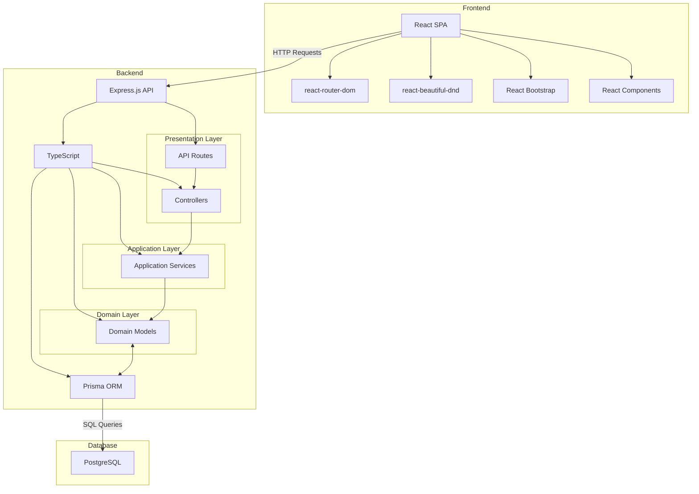
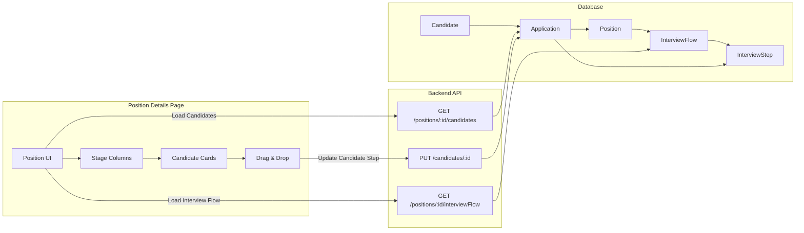

# LTI System Architecture

## Application Architecture

```mermaid
graph TD
    subgraph "Frontend"
        React["React SPA"]
        Router["react-router-dom"]
        DnD["react-beautiful-dnd"]
        Bootstrap["React Bootstrap"]
        Components["React Components"]

        React --> Router
        React --> DnD
        React --> Bootstrap
        React --> Components
    end

    subgraph "Backend"
        Express["Express.js API"]
        TypeScript["TypeScript"]
        Prisma["Prisma ORM"]

        subgraph "Domain Layer"
            Models["Domain Models"]
        end

        subgraph "Application Layer"
            Services["Application Services"]
        end

        subgraph "Presentation Layer"
            Controllers["Controllers"]
            Routes["API Routes"]
        end

        Express --> TypeScript
        TypeScript --> Prisma
        TypeScript --> Models
        TypeScript --> Services
        TypeScript --> Controllers
        Express --> Routes
        Routes --> Controllers
        Controllers --> Services
        Services --> Models
        Models <--> Prisma
    end

    subgraph "Database"
        PostgreSQL["PostgreSQL"]
    end

    React -- "HTTP Requests" --> Express
    Prisma -- "SQL Queries" --> PostgreSQL
```

## Interview Flow Management

```mermaid
flowchart LR
    subgraph "Position Details Page"
        UI["Position UI"]
        Columns["Stage Columns"]
        Cards["Candidate Cards"]
        DragDrop["Drag & Drop"]

        UI --> Columns
        Columns --> Cards
        Cards --> DragDrop
    end

    subgraph "Backend API"
        FetchFlow["GET /positions/:id/interviewFlow"]
        FetchCandidates["GET /positions/:id/candidates"]
        UpdateStep["PUT /candidates/:id"]
    end

    subgraph "Database"
        Position["Position"]
        Candidate["Candidate"]
        Application["Application"]
        InterviewStep["InterviewStep"]
        InterviewFlow["InterviewFlow"]

        Position --> InterviewFlow
        InterviewFlow --> InterviewStep
        Candidate --> Application
        Application --> Position
        Application --> InterviewStep
    end

    UI -- "Load Interview Flow" --> FetchFlow
    UI -- "Load Candidates" --> FetchCandidates
    DragDrop -- "Update Candidate Step" --> UpdateStep

    FetchFlow --> InterviewFlow
    FetchCandidates --> Application
    UpdateStep --> Application
```
